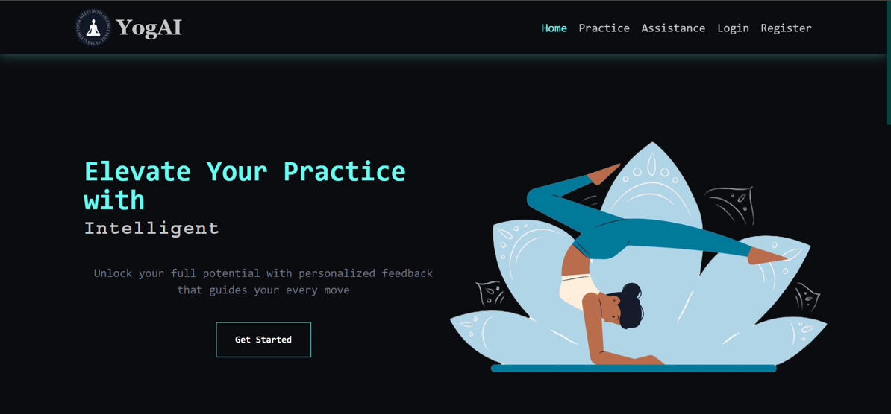
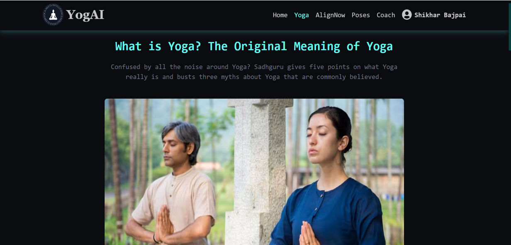
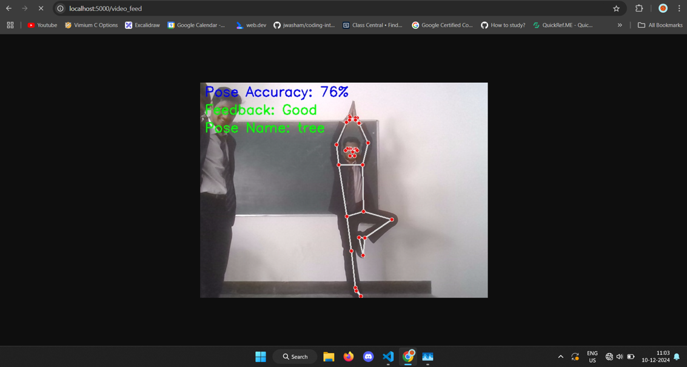
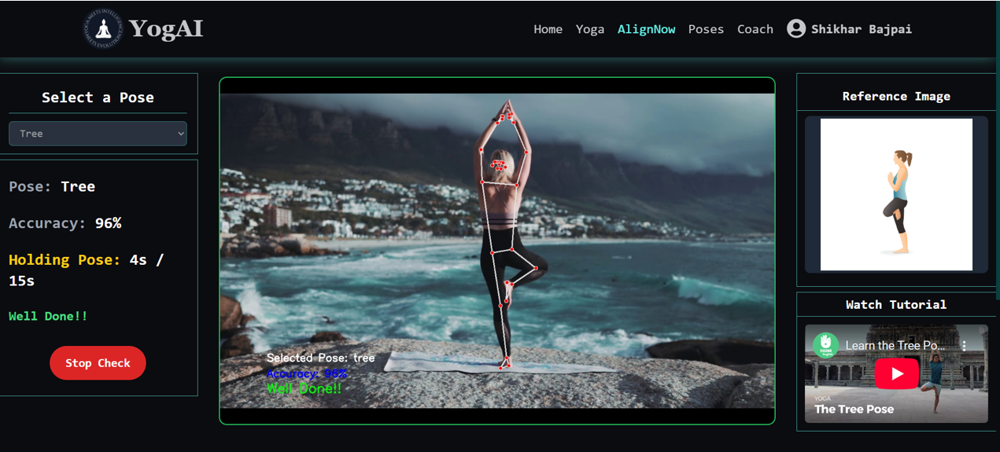
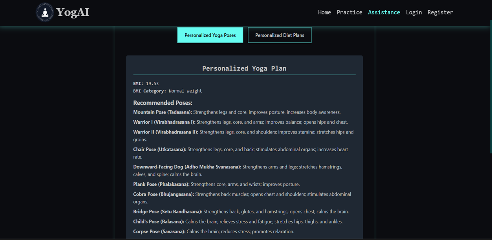
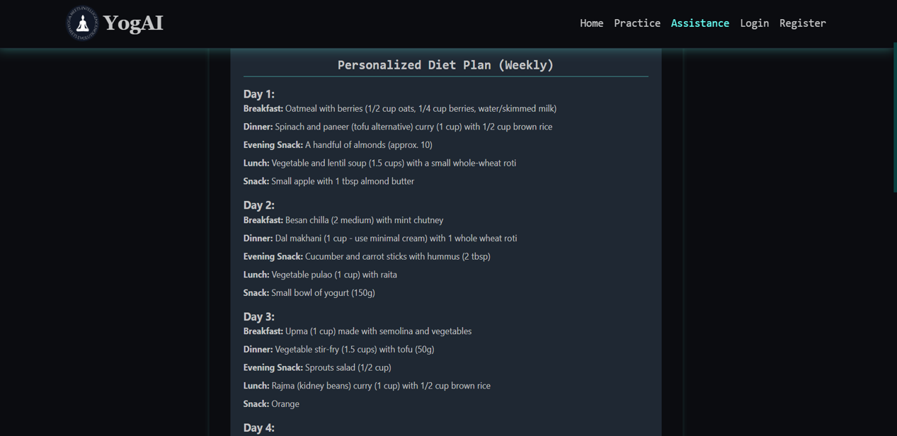

# 🧘 Yoga Pose Corrector System

This is a full-stack Yoga Pose Detection and Corrector System built using **Flask** for the backend and **React** for the frontend. It uses **MediaPipe**, **OpenCV**, **Artificial Intelligence (AI)** and **Machine Learning (ML)** techniques to identify and analyze yoga poses in real-time.

---

## 📂 Project Structure

### 🔙 Backend (Flask)

```
.
├── app.py                # Entry point of the Flask app
├── controller.py         # Route and pose control logic
├── db.py                 # Database models and setup
├── models.py             # ML/DL models
├── addPoses.py           # Add pose definitions
├── pose_model.pkl        # Trained pose classification model
├── label_encoder.pkl     # Label encoder for pose names
├── .env                  # Environment variables
├── requirements.txt      # Python dependencies
├── env/                  # Virtual environment (optional)
├── instance/             # Database or runtime instance
├── test_data/            # Sample/test inputs
└── __pycache__/          # Compiled Python files
```

### 🎨 Frontend (React)

The frontend (not shown here) is built using **React**, and provides a clean UI to upload video or use a webcam, and get real-time feedback on yoga poses.

---

## 🔧 Setup Instructions

### 1. Clone the Repository

```bash
git clone https://github.com/SHIKHAR-Bajpai/Yoga-Pose-Corrector.git
cd yoga-pose-detector
```

### 2. Backend Setup

```bash
cd backend
python -m venv env
source env/bin/activate  # or env\Scripts\activate on Windows
pip install -r requirements.txt
```

### 3. Run the Flask Server

```bash
python app.py
```

### 4. Frontend Setup

```bash
cd frontend
npm install
npm start
```

Make sure the backend is running on a known port and the frontend fetches predictions from the correct API endpoint.

---

## ✅ Features

* Real-time yoga pose detection via webcam
* Accurate ML/DL model trained on human poses
* Tracks multiple body landmarks using **MediaPipe**
* JWT-based user authentication (Flask-JWT-Extended)
* Supports Google OAuth login (Flask-Dance)
* Cross-origin enabled (flask-cors)
* SQLite/PostgreSQL support via SQLAlchemy

---

## 📊 Dependencies

Some major Python libraries used:

* `Flask`, `Flask-Cors`, `Flask-JWT-Extended`, `Flask-Dance`
* `MediaPipe`, `OpenCV`, `scikit-learn`, `TensorFlow`, `Keras`
* `SQLAlchemy`, `python-dotenv`
* `matplotlib`, `seaborn`, `pandas`, `numpy`
* Google APIs, OAuth libraries
* See full list in `requirements.txt`

---

## 📸 Screenshots

<!-- Insert screenshots below -->

| Pose Detection                  |
| ------------------------------- |
|  |
|  |
|  |
|  |
|  |
|  |

---

## 🚀 Future Improvements

* Add multilingual support
* Extend pose set to advanced yoga asanas
* Export daily stats and progress for users
* Integration with wearables

---

## 📜 License

This project is licensed under the MIT License. See the [LICENSE](LICENSE) file for details.

---

## 🙏 Acknowledgments

* [MediaPipe by Google](https://mediapipe.dev/)
* [Flask Documentation](https://flask.palletsprojects.com/)
* [React](https://reactjs.org/)

---

> Made with 💙 for health and wellness.
